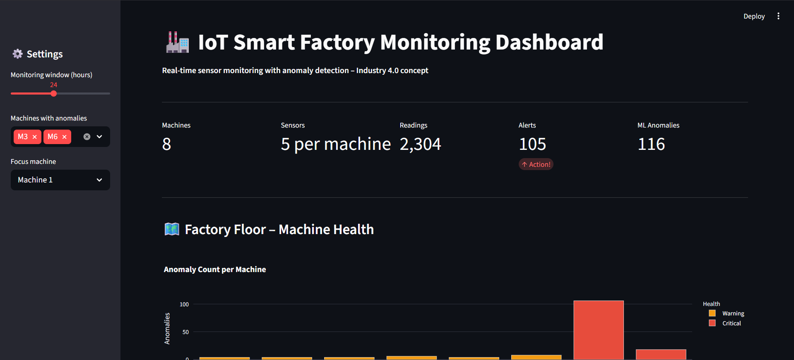

# IoT Smart Factory Monitoring Dashboard
 

 
## Overview
Real-time IoT sensor monitoring dashboard for a smart factory
floor. Simulates 8 machines with 5 sensor channels each,
threshold-based alerting, and Isolation Forest ML anomaly detection.
 
## Live Demo
**[Open Dashboard](https://your-url.streamlit.app)**
 
## Features
- 8 machines with 5 IoT sensors each (temp, vibration, pressure, humidity, power)
- Threshold-based alerts (warning + critical limits)
- Isolation Forest ML anomaly detection
- Factory floor health overview (bar chart)
- Per-machine sensor trend charts with limit lines
- Alert log with timestamp and severity
 
## Relevance to Nordhausen Mechatronics M.Eng.
- Directly matches "Industry 4.0" module
- Demonstrates IoT sensor network understanding
- Combines mechanics (vibration/pressure) + electronics (sensors) + CS (ML)
 
## Tools (Free)
Python, Streamlit, Plotly, Scikit-learn
 
## Author
**Oscar Vincent Dbritto**
